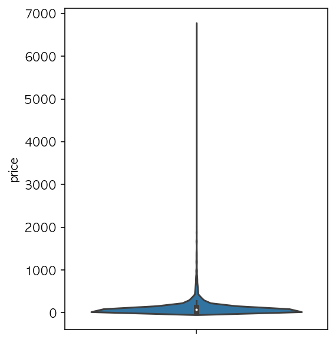
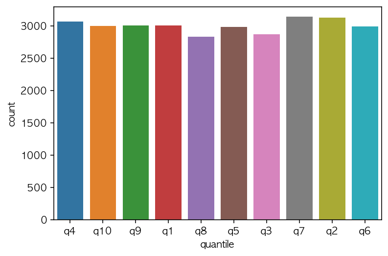

- quantile 함수를 이용하면 해당 컬럼의 십분위 값을 알 수 있습니다.
- 반복문으로 해당 행을 분위값으로 분류합니다.


```python
# 데이터 불러오기
df = pd.read_csv('datas/order_items.csv')
df = df.reset_index()[['index','price']][:30000]

df.tail()
# index = 주문 번호
# price = 주문 금액
```


<div>
<style scoped>
    .dataframe tbody tr th:only-of-type {
        vertical-align: middle;
    }

    .dataframe tbody tr th {
        vertical-align: top;
    }
    
    .dataframe thead th {
        text-align: right;
    }
</style>
<table border="1" class="dataframe">
  <thead>
    <tr style="text-align: right;">
      <th></th>
      <th>index</th>
      <th>price</th>
    </tr>
  </thead>
  <tbody>
    <tr>
      <th>29995</th>
      <td>29995</td>
      <td>34.99</td>
    </tr>
    <tr>
      <th>29996</th>
      <td>29996</td>
      <td>39.00</td>
    </tr>
    <tr>
      <th>29997</th>
      <td>29997</td>
      <td>1200.00</td>
    </tr>
    <tr>
      <th>29998</th>
      <td>29998</td>
      <td>749.90</td>
    </tr>
    <tr>
      <th>29999</th>
      <td>29999</td>
      <td>198.90</td>
    </tr>
  </tbody>
</table>
</div>


```python
# 데이터는 이런 분포로 되어있습니다.
plt.figure(figsize = (4,5))
sns.violinplot(data = df, y = 'price')
```


    <AxesSubplot:ylabel='price'>


​    

​    


## quantile 함수
- quantile 함수를 쓰면 해당 수치형 데이터의 분위 수 값을 계산할 수 있습니다.
- 시리즈.quantile(q = 분위수/전체)


```python
# 100분위 수 15
print(df['price'].quantile(q= 15/100))
# 10분위수 5
print(df['price'].quantile(q= 5/10))
# 10분위 수 10
print(df['price'].quantile(q= 10/10))

```

    29.0
    74.9
    6735.0


## 분위수 분류하기
- 첫번째 반복문은 10~1역순으로 진행됩니다.
    - 몇분위수 값을 계산하여, qi에 할당합니다.
- 두번째 반복문에서 행별로 돌아가며, 분위값 분류를 진행합니다.


```python
# 10에서 1까지 역순으로 반복
for i in range(10,0,-1):
    # qi = 얼마
    globals()[f'q{i}'] = df['price'].quantile(q = i/10)
    # 얼마까지 몇분위인지 출력
    print(f'q{i}:  ~ ' + str(round(globals()[f'q{i}'])))
    # df의 행마다 돌아가며 반복, qi값보다 작으면 'qi' 할당
    for j in df.index:
        # qi값보다 작으면, 'quantile'칼럼 값에 'qi' 할당
        if df.loc[j, 'price'] <= globals()[f'q{i}']:
            df.loc[j, 'quantile'] = f'q{i}'
```

    q10:  ~ 6735
    q9:  ~ 229
    q8:  ~ 151
    q7:  ~ 120
    q6:  ~ 95
    q5:  ~ 75
    q4:  ~ 59
    q3:  ~ 47
    q2:  ~ 35
    q1:  ~ 24


```python
# 십분위 분류가 잘 되었는지 미리보기
df.head()
```


<div>
<style scoped>
    .dataframe tbody tr th:only-of-type {
        vertical-align: middle;
    }

    .dataframe tbody tr th {
        vertical-align: top;
    }
    
    .dataframe thead th {
        text-align: right;
    }
</style>
<table border="1" class="dataframe">
  <thead>
    <tr style="text-align: right;">
      <th></th>
      <th>index</th>
      <th>price</th>
      <th>quantile</th>
    </tr>
  </thead>
  <tbody>
    <tr>
      <th>0</th>
      <td>0</td>
      <td>58.90</td>
      <td>q4</td>
    </tr>
    <tr>
      <th>1</th>
      <td>1</td>
      <td>239.90</td>
      <td>q10</td>
    </tr>
    <tr>
      <th>2</th>
      <td>2</td>
      <td>199.00</td>
      <td>q9</td>
    </tr>
    <tr>
      <th>3</th>
      <td>3</td>
      <td>12.99</td>
      <td>q1</td>
    </tr>
    <tr>
      <th>4</th>
      <td>4</td>
      <td>199.90</td>
      <td>q9</td>
    </tr>
  </tbody>
</table>
</div>


```python
# 비슷한 가격대의 주문건이 많아서 총 집계 수량이 차이납니다.
# 겹치는 수치가 적은 데이터의 경우 거의 비슷하게 나옵니다.
sns.countplot(df['quantile'])
```


    <AxesSubplot:xlabel='quantile', ylabel='count'>



    

