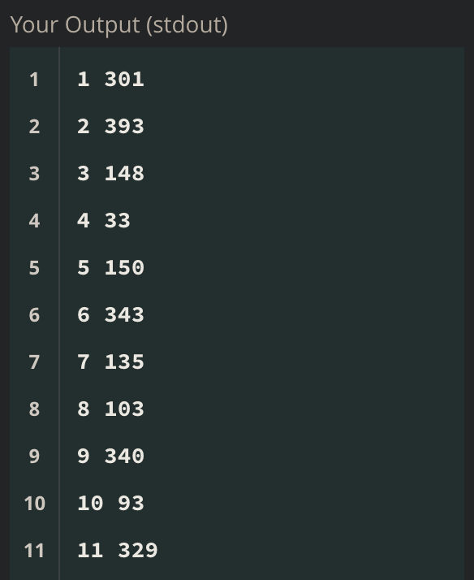

# 

---
layout: 'single'
title:  '[MySQL] set문을 활용하여 인덱스 번호 만들기'
categories:

  - sql

---


- set 문을 활용하여 사용자 정의 변수를 선언할 수 있습니다.
- 쿼리의 가장 앞에 사용합니다.

```sql
# @v는 변수이름, 변수에 0을 할당
set @v := 0;
```

- @를 통해 변수명을 지정합니다.

- :=는 이항 대입연산자입니다.

  - set 이외의 명령문에서는 '='가 비교연산자로 사용되기 때문에, 구분하기 위해 ':='를 사용합니다.

  - ex) @v = 5 (변수 @v가 5인가 아닌가) , @v := 5 (변수 @v에 5를 할당)

    

- 아래 방법으로 행의 인덱스 번호를 지정할 수 있습니다.

```sql
# @v 0으로 할당
set @v := 0;
# @v에 행을 내려가며 1씩 더하기(첫 행부터 더하므로 1,2,3...)
select @v := @v + 1, a.*
from tabel a
```

- 아래와 같은 결과물이 나옵니다.

